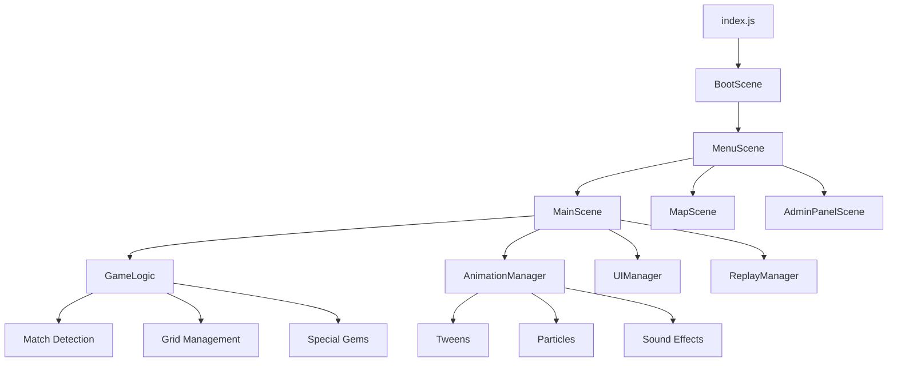

# Архитектура проекта

Подробное описание архитектуры Match-3 Engine, включая структуру кода, паттерны проектирования и взаимодействие компонентов.

## 🏗️ Общая архитектура



## 📁 Структура проекта

### Основные директории

```
src/
├── index.js                 # Точка входа приложения
├── config.js               # Глобальные настройки
├── scenes/                 # Игровые сцены
│   ├── BootScene.js        # Загрузка ресурсов
│   ├── MenuScene.js        # Главное меню
│   ├── main-scene.js       # Основная игровая логика
│   ├── MapScene.js         # Карта миссий
│   └── AdminPanelScene.js  # Панель администратора
├── core/                   # Основная логика
│   ├── GameLogic.js        # Игровая механика
│   └── ReplayManager.js    # Система воспроизведения
├── animations/             # Система анимаций
│   └── AnimationManager.js # Менеджер анимаций
├── ui/                     # Пользовательский интерфейс
│   └── UIManager.js        # Менеджер UI
└── utils/                  # Утилиты
    └── logger.js           # Система логирования
```

## 🎮 Система сцен

### Паттерн: State Machine

Игра использует систему сцен Phaser 3 как конечный автомат:

```javascript
// Переходы между сценами
class SceneManager {
    transitions = {
        Boot: ['Menu'],
        Menu: ['MainScene', 'MapScene', 'AdminPanel'],
        MainScene: ['Menu', 'MapScene'],
        MapScene: ['Menu', 'MainScene'],
        AdminPanel: ['Menu']
    };
}
```

### Жизненный цикл сцены

```javascript
class BaseScene extends Phaser.Scene {
    preload() {
        // Загрузка ресурсов
    }
    
    create() {
        // Инициализация объектов
    }
    
    update() {
        // Обновление каждый кадр
    }
    
    shutdown() {
        // Очистка ресурсов
    }
}
```

## 🧩 Основные компоненты

### 1. MainScene - Центральный контроллер

**Ответственности**:
- Управление игровым циклом
- Обработка пользовательского ввода
- Координация работы других компонентов
- Отрисовка игрового поля

```javascript
class MainScene extends Phaser.Scene {
    constructor() {
        // Инициализация зависимостей
        this.gameLogic = new GameLogic();
        this.animationManager = new AnimationManager();
        this.uiManager = new UIManager();
        this.replayManager = new ReplayManager();
    }
}
```

### 2. GameLogic - Игровая логика

**Паттерн**: Business Logic Layer

**Ответственности**:
- Детекция матчей
- Применение гравитации
- Генерация новых элементов
- Валидация ходов

```javascript
class GameLogic {
    detectMatches(grid) {
        // Чистая функция без side effects
        return matches;
    }
    
    applyGravity(grid) {
        // Изменение состояния grid
    }
    
    isValidMove(from, to, grid) {
        // Проверка валидности без изменения состояния
    }
}
```

### 3. AnimationManager - Система анимаций

**Паттерн**: Command Pattern

**Ответственности**:
- Управление анимациями
- Синхронизация эффектов
- Производительность

```javascript
class AnimationManager {
    async executeSequence(commands) {
        for (const command of commands) {
            await command.execute();
        }
    }
    
    addTween(target, properties) {
        return this.scene.tweens.add({
            targets: target,
            ...properties
        });
    }
}
```

## 🎯 Паттерны проектирования

### 1. MVC (Model-View-Controller)

- **Model**: GameLogic, ReplayManager
- **View**: Sprites, UI elements, Animations
- **Controller**: MainScene, input handlers

### 2. Observer Pattern

```javascript
class EventEmitter {
    constructor() {
        this.events = {};
    }
    
    on(event, callback) {
        if (!this.events[event]) {
            this.events[event] = [];
        }
        this.events[event].push(callback);
    }
    
    emit(event, data) {
        if (this.events[event]) {
            this.events[event].forEach(callback => callback(data));
        }
    }
}

// Использование
this.gameLogic.on('matchFound', (matches) => {
    this.animationManager.animateMatches(matches);
});
```

### 3. Factory Pattern

```javascript
class GemFactory {
    static createGem(type, x, y, scene) {
        switch(type) {
            case 1: return new BasicGem(x, y, scene, 'red');

            case 9: return new DroneGem(x, y, scene);
            default: return new BasicGem(x, y, scene, 'default');
        }
    }
}
```

### 4. Strategy Pattern

```javascript
class SpecialGemStrategy {
    constructor() {
        this.strategies = {
            7: new VerticalBombStrategy(),
            8: new HorizontalBombStrategy(),
            9: new DroneStrategy(),
            10: new DiscoBallStrategy(),
            11: new DynamiteStrategy()
        };
    }
    
    activate(type, x, y) {
        return this.strategies[type].execute(x, y);
    }
}
```

## 🔄 Управление состоянием

### Game State

```javascript
class GameState {
    constructor() {
        this.grid = [];
        this.sprites = [];
        this.score = 0;
        this.moves = 0;
        this.objective = null;
        this.collectedGems = {};
    }
    
    // Immutable updates
    updateGrid(newGrid) {
        return {
            ...this,
            grid: newGrid.map(row => [...row])
        };
    }
}
```

### State Transitions

```javascript
// Детерминированные переходы состояния
const gameStateMachine = {
    IDLE: {
        MOVE: 'ANIMATING'
    },
    ANIMATING: {
        COMPLETE: 'PROCESSING'
    },
    PROCESSING: {
        MATCHES_FOUND: 'ANIMATING',
        NO_MATCHES: 'IDLE',
        GAME_OVER: 'FINISHED'
    },
    FINISHED: {
        RESTART: 'IDLE'
    }
};
```

## 🎭 Система анимаций

### Архитектура анимаций

```javascript
class AnimationSystem {
    constructor(scene) {
        this.scene = scene;
        this.animationQueue = [];
        this.isPlaying = false;
    }
    
    async playSequence(animations) {
        this.animationQueue.push(...animations);
        if (!this.isPlaying) {
            await this.processQueue();
        }
    }
    
    async processQueue() {
        this.isPlaying = true;
        
        while (this.animationQueue.length > 0) {
            const animation = this.animationQueue.shift();
            await this.playAnimation(animation);
        }
        
        this.isPlaying = false;
    }
}
```

### Типы анимаций

1. **Последовательные**: выполняются одна за другой
2. **Параллельные**: выполняются одновременно
3. **Каскадные**: с задержками между элементами

```javascript
// Каскадная анимация
async animateMatchesCascade(matches) {
    const promises = matches.map((match, index) => {
        return new Promise(resolve => {
            this.scene.time.delayedCall(index * 100, () => {
                this.animateMatch(match).then(resolve);
            });
        });
    });
    
    await Promise.all(promises);
}
```

## 🎲 Детерминированная система

### Архитектура PRNG

```javascript
class DeterministicRandom {
    constructor(seed) {
        this.rng = new Math.seedrandom(seed);
        this.callCounter = 0;
        this.actionLog = [];
    }
    
    getRandomTracked(min, max, context) {
        const value = Math.floor(this.rng() * (max - min + 1)) + min;
        
        this.actionLog.push({
            call: this.callCounter++,
            context: context,
            min: min,
            max: max,
            result: value,
            timestamp: Date.now()
        });
        
        return value;
    }
}
```

### Replay System

```javascript
class ReplayManager {
    constructor() {
        this.actions = [];
        this.currentAction = 0;
    }
    
    recordAction(action) {
        this.actions.push({
            ...action,
            timestamp: Date.now(),
            randomState: this.getCurrentRandomState()
        });
    }
    
    async playback() {
        for (const action of this.actions) {
            await this.executeAction(action);
            await this.waitForSync();
        }
    }
}
```

## 🔧 Система конфигурации

### Централизованная конфигурация

```javascript
// config.js
export const CONFIG = {
    GAME: {
        GRID_WIDTH: 8,
        GRID_HEIGHT: 8,
        MAX_MOVES: 30,
        GEM_TYPES: 5
    },
    
    ANIMATION: {
        SWAP_DURATION: 200,
        MATCH_DURATION: 400,
        GRAVITY_DURATION: 300,
        PARTICLE_LIFETIME: 1000
    },
    
    AUDIO: {
        MASTER_VOLUME: 1.0,
        SFX_VOLUME: 0.7,
        MUSIC_VOLUME: 0.5
    },
    
    VISUAL: {
        GEM_SIZE: 64,
        SPACING: 4,
        EFFECTS_QUALITY: 'high'
    }
};
```

### Environment-specific configs

```javascript
class ConfigManager {
    static getConfig() {
        const baseConfig = CONFIG;
        const envConfig = this.getEnvironmentConfig();
        
        return this.mergeConfigs(baseConfig, envConfig);
    }
    
    static getEnvironmentConfig() {
        if (process.env.NODE_ENV === 'development') {
            return DEV_CONFIG;
        } else if (process.env.NODE_ENV === 'production') {
            return PROD_CONFIG;
        }
        return {};
    }
}
```

## 🏗️ Модульная архитектура

### Dependency Injection

```javascript
class DIContainer {
    constructor() {
        this.services = new Map();
        this.singletons = new Map();
    }
    
    register(name, factory, singleton = false) {
        this.services.set(name, { factory, singleton });
    }
    
    resolve(name) {
        if (this.singletons.has(name)) {
            return this.singletons.get(name);
        }
        
        const service = this.services.get(name);
        if (!service) {
            throw new Error(`Service ${name} not found`);
        }
        
        const instance = service.factory();
        
        if (service.singleton) {
            this.singletons.set(name, instance);
        }
        
        return instance;
    }
}

// Использование
const container = new DIContainer();
container.register('gameLogic', () => new GameLogic(), true);
container.register('animationManager', () => new AnimationManager());
```

## 📊 Система метрик

### Performance Monitoring

```javascript
class PerformanceMonitor {
    constructor() {
        this.metrics = {
            fps: [],
            renderTime: [],
            animationTime: [],
            memoryUsage: []
        };
    }
    
    startMeasure(label) {
        performance.mark(`${label}-start`);
    }
    
    endMeasure(label) {
        performance.mark(`${label}-end`);
        performance.measure(label, `${label}-start`, `${label}-end`);
        
        const measure = performance.getEntriesByName(label)[0];
        this.recordMetric(label, measure.duration);
    }
    
    recordMetric(type, value) {
        this.metrics[type].push({
            value: value,
            timestamp: Date.now()
        });
        
        // Ограничиваем размер истории
        if (this.metrics[type].length > 1000) {
            this.metrics[type].shift();
        }
    }
}
```

## 🧪 Тестируемость

### Разделение логики и представления

```javascript
// Чистая функция - легко тестируется
function detectHorizontalMatches(grid) {
    const matches = [];
    
    for (let y = 0; y < grid.length; y++) {
        let currentMatch = [];
        let currentGem = null;
        
        for (let x = 0; x < grid[y].length; x++) {
            if (grid[y][x] === currentGem && currentGem !== 0) {
                currentMatch.push({x, y});
            } else {
                if (currentMatch.length >= 3) {
                    matches.push([...currentMatch]);
                }
                currentMatch = [{x, y}];
                currentGem = grid[y][x];
            }
        }
        
        if (currentMatch.length >= 3) {
            matches.push([...currentMatch]);
        }
    }
    
    return matches;
}
```

### Mock объекты для тестирования

```javascript
class MockScene {
    constructor() {
        this.tweens = new MockTweenManager();
        this.sound = new MockSoundManager();
        this.add = new MockGameObjectFactory();
    }
}

// Тестирование
describe('GameLogic', () => {
    it('should detect horizontal matches', () => {
        const grid = [
            [1, 1, 1, 2],
            [2, 3, 4, 5],
            [3, 3, 3, 3]
        ];
        
        const matches = detectHorizontalMatches(grid);
        expect(matches).toHaveLength(2);
        expect(matches[0]).toHaveLength(3);
        expect(matches[1]).toHaveLength(4);
    });
});
```

## 🔒 Безопасность и валидация

### Input Validation

```javascript
class InputValidator {
    static validateMove(from, to, gridSize) {
        // Проверка границ
        if (from.x < 0 || from.x >= gridSize.width || 
            from.y < 0 || from.y >= gridSize.height) {
            throw new Error('Invalid from position');
        }
        
        if (to.x < 0 || to.x >= gridSize.width || 
            to.y < 0 || to.y >= gridSize.height) {
            throw new Error('Invalid to position');
        }
        
        // Проверка соседства
        const distance = Math.abs(from.x - to.x) + Math.abs(from.y - to.y);
        if (distance !== 1) {
            throw new Error('Gems must be adjacent');
        }
        
        return true;
    }
}
```

## 📈 Масштабируемость

### Modular Loading

```javascript
class ModuleLoader {
    static async loadGameModule(moduleName) {
        switch(moduleName) {
            case 'specialGems':
                return await import('./modules/SpecialGemsModule.js');
            case 'powerUps':
                return await import('./modules/PowerUpsModule.js');
            case 'multiplayer':
                return await import('./modules/MultiplayerModule.js');
            default:
                throw new Error(`Unknown module: ${moduleName}`);
        }
    }
}
```

### Plugin Architecture

```javascript
class PluginManager {
    constructor() {
        this.plugins = new Map();
    }
    
    register(plugin) {
        this.plugins.set(plugin.name, plugin);
        plugin.initialize(this);
    }
    
    getPlugin(name) {
        return this.plugins.get(name);
    }
    
    executeHook(hookName, ...args) {
        for (const plugin of this.plugins.values()) {
            if (plugin.hooks && plugin.hooks[hookName]) {
                plugin.hooks[hookName](...args);
            }
        }
    }
}
```

---

Данная архитектура обеспечивает:
- ✅ **Модульность**: чёткое разделение ответственностей
- ✅ **Тестируемость**: изоляция логики от представления
- ✅ **Расширяемость**: plugin система и DI контейнер
- ✅ **Производительность**: оптимизированные анимации и рендеринг
- ✅ **Надёжность**: детерминированная система и валидация 